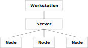

.. -*- mode: rst -*-
.. This document is formatted for rst2s5
.. http://docutils.sourceforge.net/

==================================
 Konfigurationshantering med Chef
==================================

|

|

|

|

.. class:: center

    Jonas Linde <jonas.linde@b3.se>

.. raw:: pdf

      PageBreak oneColumn

.. footer::
  jonas.linde@b3.se

.. role:: single
   :class: single

.. role:: grey
   :class: grey

.. default-role:: literal

B3 Init AB
==========

* IT-konsulter sedan 1994
* Infrastruktur
* Systemutveckling
* Ledning och Styrning
* DevOps
* Sedan 2017 en del av *B3 Consulting Group*

.. class:: illustration

Jonas Linde
===========

* IT-konsult sedan 1997
* Infrastruktur
* Systemutveckling
* Ledning och Styrning
* DevOps

.. class:: illustration
.. image:: img/mii.png
     :alt: [me]

Agenda
======

* Bakgrund
* Övning
* Uppbyggnad
* Exekvering
* Sammanfattning
* Övningar

.. class:: illustration
.. image:: img/lingon.png
     :alt: [lingon]

:single:`Bakgrund`
==================

Alternativ
==========

* CFEngine - 1993
* Puppet - 2005
* Chef - 2009
* Ansible - 2012
* Docker - 2013
* Serverless - 2014

.. class:: illustration

Chef
====

* OpsCode Inc - 2009
* Chef Inc - 2013
* Open Source Chef

  + https://downloads.chef.io

* InSpec - securty & compliance
* Habitat - platform-independent build artifacts
* Chef Automate - enterprise platform

 + bygger på Chef InSpec och Habitat

.. class:: illustration

Buzz words
==========

* Systems Integration Framework
* Configuration Management and Automation Platform
* Configuration as Code

Arkitektur
==========

.. class:: right

* workstation
* server
* nodes

Chef Server
===========

* Centralt lager för kokböcker och metadata

  + cookbooks
  + roles
  + environments
  + data_bags
  + nodes

* Har ett WebUI

  + inte Open Source
  + gratis upp till 25 noder

Workstation
===========

* Hanterar servern
* Använder `knife` för att kommunicera med servern och noderna
* Kan använda `chef-run` för att köra ad-hoc på noder
  + `chef-workstation` är ett paket att ladda ner från https://chef.io/downloads
* `chefdk` är ett liknande paket byggt av communityn
* Med `knife` kan man en hämta kokböcker från communityn

  .. code::

     knife supermarket search apt
     knife supermarket download aptly

Node
====

* Kör `chef-client` regelbundet
* Hämtar konfiuration från servern
* Exekverar kokböcker

  + test and repair

* Med `chef-solo` kan man köra utan central server

Övning
======

* Installera Chef Workstation

  + https://learn.chef.io/modules/try-chef

* Kör steg 1-3

  + det finns buggar i steg 3 respektive 5
  + om man kör steg 4 före steg 3 så försvinner det första problemet - varför?

:single:`Uppbyggnad`
====================

Begrepp
=======

* `chef-repo`
* `cookbook`
* `recipe`
* `resource`

  + https://docs.chef.io/resource.html

* `attribute`

chef-repo
=========

* Innehåller

  + `roles/`
  + `environments/`
  + `data_bags/`

* Läs mer: http://docs.chef.io/chef_repo.html

Några resurser
==============

* `cron`
* `execute`

  + `bash`

* `file`
* `package`

  + `apt_package`
  + `apt_update`

* `service`
* `template`
* `user`

Resursexempel
=============

  .. code::

    package 'tar' do
      version '1.16.1'
      action :install
    end

  eller

  .. code::

    package 'tar' do
      version '1.16.1'
    end

  eller

  .. code::

    package 'tar'

Resursexempel
=============

  .. code::

     bash 'extract_module' do
       cwd ::File.dirname(src_filepath)
       code <<-EOH
         mkdir -p #{extract_path}
         tar xzf #{src_filename} -C #{extract_path}
         mv #{extract_path}/*/* #{extract_path}/
         EOH
       not_if { ::File.exist?(extract_path) }
     end

Kedja
=====

  .. code::

     execute 'test-nagios-config' do
       command 'nagios3 --verify-config'
       action :nothing
     end

     template '/etc/nagios3/configures-nagios.conf' do
       # other parameters
       notifies :run, 'execute[test-nagios-config]', :delayed
     end

  eller

  .. code::

     execute 'test-nagios-config' do
       command 'nagios3 --verify-config'
       action :nothing
       subscribes :run, 'template[/etc/nagios3/configures-nagios.conf]', :immediately
     end

Cookbook
========

* Innehåller

  + `README.md`
  + `metadata.rb`
  + `recipes/`
  + `attributes/`
  + `files/`
  + `templates/`
  + `extensions/`

Attributes
==========

* Kommer från

  + `ohai` - verktyg som samlar fakta om noden
  + `attributes/`
  + `recipes/`
  + `environments/`
  + `roles/`

* Exempel:

  .. code::

     $ cat cookbooks/starter/attributes/default.rb
     default["starter_name"] = "Sam Doe"
     override["system_name"] = "Chef Starter"

* Läs mer: https://docs.chef.io/attributes.html

Attributordning
===============

.. image:: img/chef_attributes_table.png
     :alt: [Chef Attributes]
     :width: 70%

Template
========

* Exempel:

  .. code::

     $ cat webserver/templates/index.html.erb
     <html>
       <head>
         <title>Learn Chef Demo</title>
       </head>
       <body>
         <h1>Hello Learn Chef</h1>
         
This is <%=node['hostname']%>

       </body>
     </html>

Recipe
======

* En samling resurser
* Kan även innehålla styrkoder

  + villkor: `case`, `if`, `unless`
  + loopar: `each`

* Läs mer: https://docs.chef.io/recipes.html

Exempelrecept
=============

  .. code::

     $ cat webserver/recipes/default.rb
     #
     # Cookbook:: webserver
     # Recipe:: default
     #
     # Copyright:: 2018, The Authors, All Rights Reserved.
     apt_update

     package 'apache2'

     template '/var/www/html/index.html' do
       source 'index.html.erb'
     end

     service 'apache2' do
       action [:enable, :start]
     end

Environment
===========

  .. code::

     {
       "chef_type": "environment",
       "json_class": "Chef::Environment",
       "name": "dev",
       "description": "Dev Environment",
       "default_attributes": {
         "apache2": {
           "listen_ports": [
             "80"
           ]
         }
       },
       "cookbook_versions": {
         "couchdb": "= 11.0.0"
       }
     }

Role
====

  .. code::

     {
       "chef_type": "role",
       "json_class": "Chef::Role",
       "name": "webserver",
       "description": "The base role for systems that serve HTTP traffic",
       "default_attributes": {
         "apache2": {
           "listen_ports": [
             "80"
           ]
         }
       },
       "run_list": [
         "recipe[apache2]",
         "recipe[apache2::mod_ssl]",
         "role[monitor]"
       ]
     }

:single:`Exekvering`
====================

Grundflöde
==========

* På workstation skrivs kokböcker och roller m.m.
* Med `knife` laddas allt upp till servern
* Noderna kör `chef-client` som hämtar konfiguration från servern och exekverar recepten
* `cron` kan användas för att starta `chef-client` periodiskt
* Med `knife` kan man `bootstrap`:a en nod

Solo
====

* `chef-solo` är en lokal Chef-server
* Kommandot `'chef-client -z ...'` startar en lokal server

  + och kör sedan mot den

Ad-hoc
======

* Kommandot `chef-run` kör enstaka recept på en eller fler noder

Körlista
========

* Listan av recept som ska exekveras kan anges

  + på kommandoraden
  + på kommandoraden i cron
  + i en roll

* Om ingen `run_list` eller `role` anges, används senaste lyckade exekvering

  + sparas i `node`-objektet på servern

:single:`Sammanfattning`
========================

Configuration as Code
=====================

* Resurser specificeras i recept i kokböcker
* Environments och roller specificerar vilka recept som ska köras
* Attribut kan sättas på många olika sätt
* Avsett att köras med `pull` i client-server-arkitektur
* Men kan även köras med `push` med eller utan server

Nackdelar
=========

* Kokbokshanteringen är ömtålig
* Attributordningen är hemsk
* Serverbegreppet är gammalmodigt
* Pull-metoden kräver övervakning
* Servern är besvärlig

Fördelar
========

* Kan hantera **hela** infrastrukturen

  + automatisering
  + kontroll

* Pull-metoden ger parallela körningar
* Kraftfullt språk
* Finns för många OS
* Kan hantera publika moln

Övningar
========

* Kör färdigt `try-chef`

  + Föreslå en lösning på felet i steg fem

    .. code::

       curl: (7) Failed to connect to lb port 80: Connection refused

* Skriv en enkel egen kokbok som t.ex.

  + skapar en fil som ägs av `myuser:mygroup` och har filskyddet `-r--r--r--`
  + skapar en fil med innehållet `"filen ligger på <hostname>"` där
    `<hostname>` är `web1`, `web2` eller `lb` beroende på nod
  + uppgraderar alla paket på en nod

* Skaffa en chef-server

  + https://manage.chef.io/signup
  + gratis upp till 5 noder och 2 användare

:single:`Tack för ordet!`
=========================

.. class:: illustration
.. image:: img/dominoes2.jpg
     :alt: [more dominoes]
