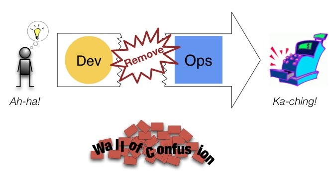
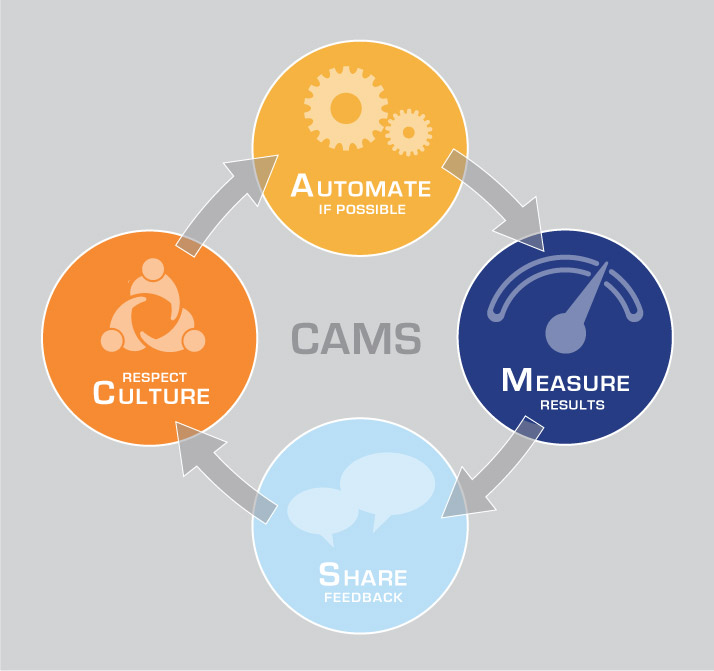
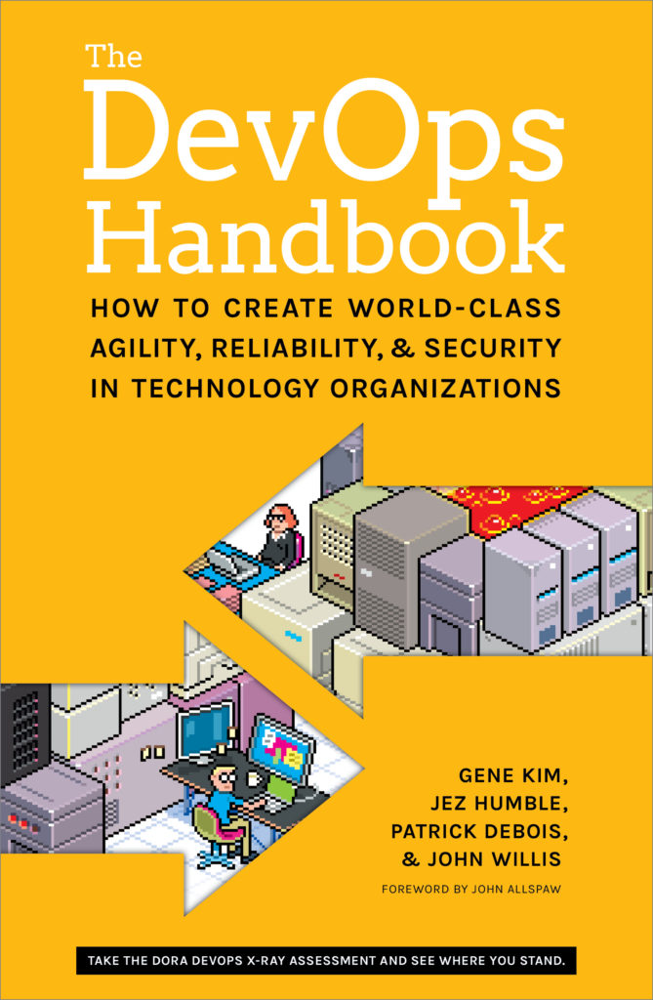
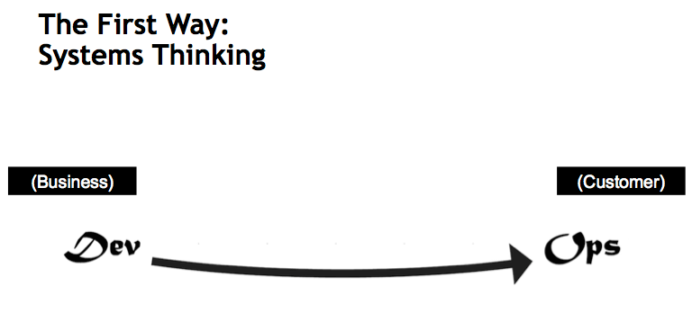
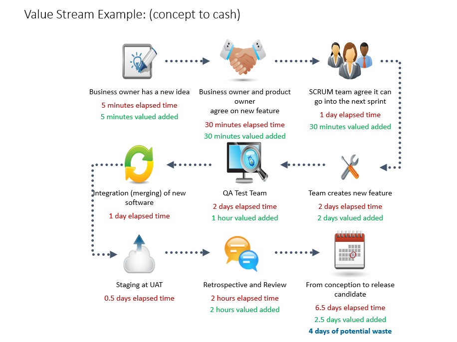
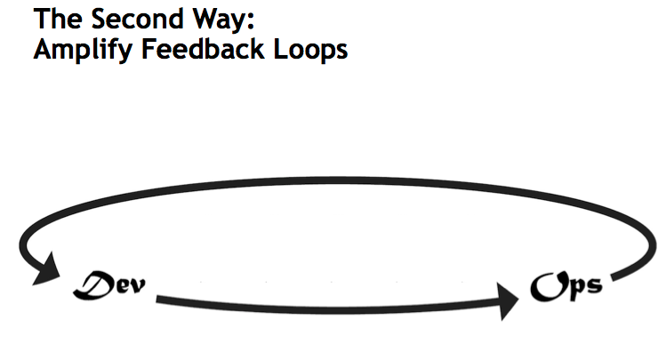
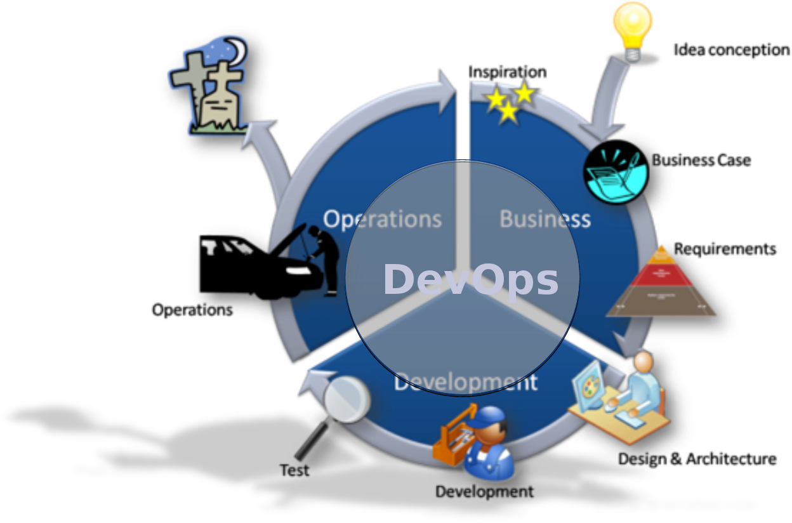
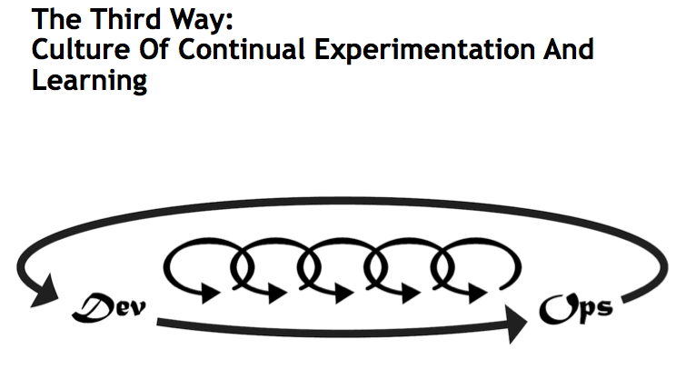
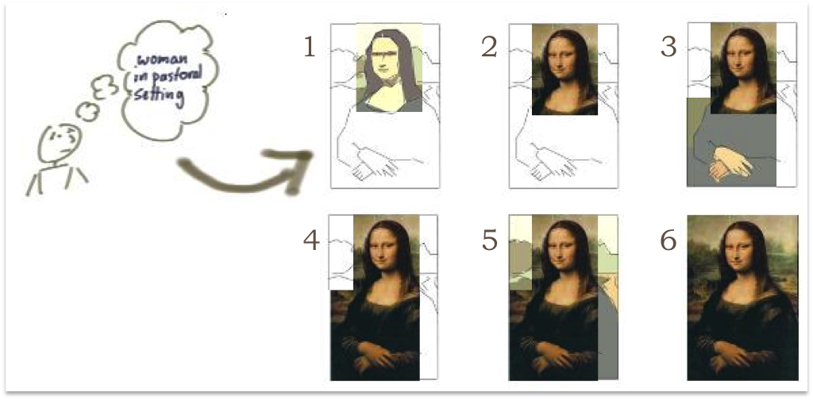

.. -*- mode: rst -*-
.. This document is formatted for rst2s5
.. http://docutils.sourceforge.net/

==================
 DevOps-filosofin
==================

|

|

|

.. image:: img/b3-tagline.png
   :alt: B3 Init
   :target: http://b3.se/
   :width: 50%

|

.. class:: center

    Jonas Linde <jonas.linde@b3.se>

.. raw:: pdf

      PageBreak oneColumn

.. footer::
  jonas.linde@b3.se

.. role:: single
   :class: single

.. role:: grey
   :class: grey

.. default-role:: literal

DevOpsDays 2009
===============

.. image:: img/devopsdays.png
     :width: 70%

Problemet
=========

.. image:: img/wallofconfusion.png
     :width: 60%

Lösningen
=========

Utveckling
==========

Prioritet
=========

Böcker
======

Rapporter
=========

Filosofin - steg 1
==================

Value Stream
============

Filosofin - steg 2
==================

Cirkelrörelse
=============

Filosofin - steg 3
==================

Inkrementering/Iteration
========================

Inkrementering+Iteration
========================

Vår definition av DevOps
========================

    Filosofi för organisationers kultur, struktur och arbetssätt som gör

    det möjligt att bygga, leverera och underhålla precis rätt IT-tjänst

    mer effektivt och med större tillförlitlighet
