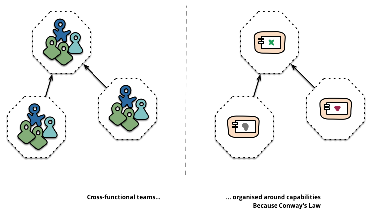
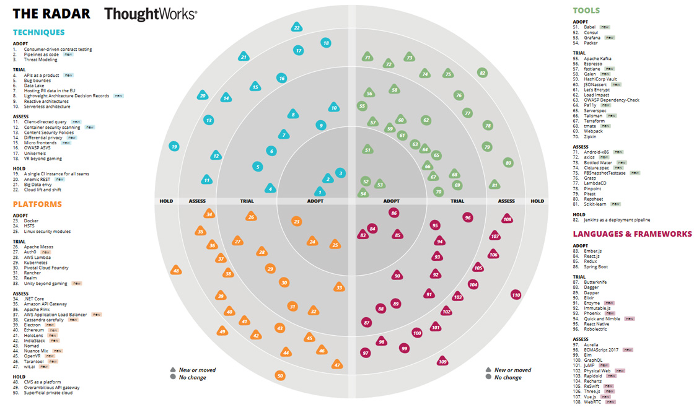
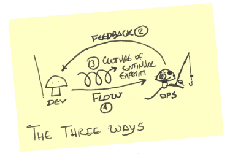

.. -*- mode: rst -*-
.. This document is formatted for rst2s5
.. http://docutils.sourceforge.net/

=======================
 DevOps - ett kundcase
=======================

|

|

|

|

.. class:: center

    Jonas Linde <jonas.linde@b3.se>

.. raw:: pdf

      PageBreak oneColumn

.. footer::
  jonas.linde@b3.se

.. role:: single
   :class: single

.. role:: grey
   :class: grey

.. default-role:: literal

Kundbeskrivning
===============

* ett företag i finansbranchen
* vill förbättra shoppingupplevelsen
* huvudsakligen digitala tjänster

.. class:: illustration

Organisation
============

* några hundra produktteam om vardera 5-10 personer

  * varje team har fullt ansvar för sin tjänst

* de flesta teamen har tjänster som hanterar konsumentdata
* ingen driftsorganisation

  * några team har tjäster som används av andra team

.. class:: illustration

Tekniska val
============

* huvudsakligen AWS
* ett fåtal egna servrar
* Tech Radar

.. class:: illustration

Tech Radar
==========

Tekniska rekommendationer
=========================

* kommunikation

  * G Suite
  * Slack

* versionshantering

  * Bitbucket

* platform

  * GNU Linux - CentOS
  * virtuella servrar (AWS EC2)
  * docker (AWS ECS)

* mätning, monitorering och loggning

  * Datadog
  * Splunk

.. class:: right
.. image:: img/dominoes.png
   :width: 20%

Tekniska rekommendationer
=========================

* larmhantering

  * OpsGenie

* automatisering

  * Jenkins
  * Concourse

* konfigurationshantering

  * Ansible

* språk

  * Java
  * Node
  * Python

.. class:: right
.. image:: img/dominoes.png
   :width: 20%

DevOps?
=======

* empowered teams
* end-to-end responsibility
* automated builds and testing
* metrics and monitoring
* blameless post mortems
* experimentation platform

.. class:: illustration

C.A.M.S.
========

* Culture

  * empowered teams
  * end-to-end responsibility
  * experimentation platform

* Automation

  * automated builds and testing

* Metrics

  * metrics and monitoring

* Sharing

  * blameless post mortems

.. class:: right
.. image:: img/CAMS-graphic_V2.jpg
   :width: 30%

The three ways
==============

* First way - systems thinking

  * empowered teams
  * end-to-end responsibility

* Second way - feedback loop

  * metrics and monitoring
  * blameless post mortems

* Third way - culture of continuous experimentation

  * automated builds and testing
  * experimentation platform

.. class:: right

DevOps i praktiken - problem ett
================================

* ett team tillhandahåller Jenkins-servrar till övriga team
* policyn säger att säkerhetspatchar ska appliceras inom 30 dagar
* vem ansvarar?

.. class:: illustration
.. image:: img/jenkins.png

DevOps i praktiken - problem två
================================

* vissa nätverksändringar sker via JIRA-ticket
* en DNS-ändring kan ta en vecka

.. class:: illustration
.. image:: img/jira.jpg

DevOps i praktiken - problem tre
================================

* alla utvecklare använder samma licensserver
* okända kostnader för produktteamen

.. class:: illustration

DevOps i praktiken - problem fyra
=================================

* under Thanksgiving och Jul är det ändringsstopp
* stressade ändringar innan
* ansamlade ändringar efter
* undantag om man implementerat continuous delivery

.. class:: illustration

Sammanfattning
==============

* kunden vet hur de vill att det ska fungera
* men kulturförändringar är svårt
* DevOps är kanske mer ett mål än ett medel

.. class:: illustration

:single:`Tack för ordet!`
=========================

.. class:: illustration
.. image:: img/dominoes2.jpg
