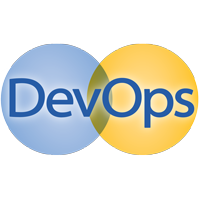
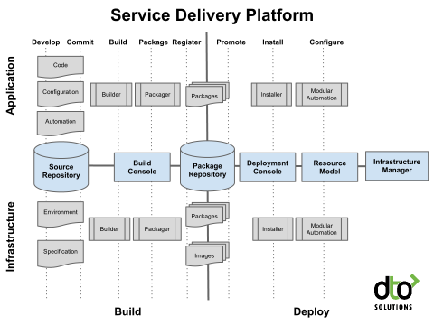
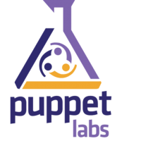
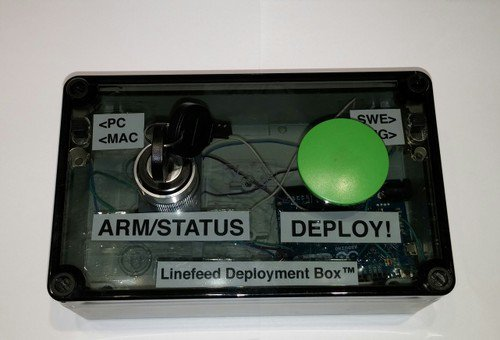
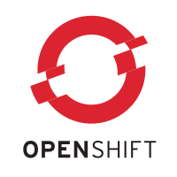

.. -*- mode: rst -*-
.. This document is formatted for rst2s5
.. http://docutils.sourceforge.net/

==================
 DevOps-processer
==================

|

|

|

.. image:: img/init180x170.gif
   :alt: Init AB
   :target: http://www.init.se/

|

.. class:: center

    Jonas Linde <jonas@init.se>

.. raw:: pdf

      PageBreak oneColumn

.. footer::
  jonas.linde@init.se

.. role:: single
   :class: single

.. role:: grey
   :class: grey

Init AB
=======

* IT-konsulter sedan 1994
* Infrastruktur
* Systemutveckling
* Ledning och Styrning
* DevOps

.. class:: illustration
.. image:: img/init180x170.gif
           :alt: [init ab]
  
Jonas Linde
===========

* IT-konsult sedan 1997
* Infrastruktur
* Systemutveckling
* Ledning och Styrning
* DevOps

.. class:: illustration
.. image:: img/mii.png
     :alt: [me]

:single:`Bakgrund`
==================

DevOps ≈ C.A.M.S.
=================

* Culture
* Automation
* Metrics
* Sharing

.. class:: illustration

Prioritering
============

#. Människor
#. Processer
#. Verktyg

.. class:: illustration
.. image:: img/dominoes.png
     :alt: [dominoes]

Missuppfattningar
=================

* En produkt
* En grupp
* En titel

.. class:: illustration
.. image:: img/lingon.png
     :alt: [lingon]

:single:`Hur har andra tänkt?`
==============================
  
Gartner DevOps Toolchains
=========================

* Build and Release Management Toolchain
* Configuration Management Toolchain
* Production Operations Management

DTO Service Delivery Platform
=============================

Puppet Labs Toolchain
=====================

* Provisioning
* Configuration Management
* Code Check-in
* Orchestration
* Monitoring
* Metrics

.. class:: illustration

DevOps Toolchain Group
======================

* Control
* Provisioning
* Release
* Model
* Monitoring
* Sources
* https://code.google.com/p/devops-toolchain/

:single:`Att göra`
==================

Att göra-lista
==============

.. class:: narrow

* Planering
* Kodning
* Bygge
* Paketering
* Testning
* Driftsättning
* Konfigurering
* Drift
* Monitorering
* Automatisering
* Virtualisering

.. class:: illustration
.. image:: img/checkbox.gif
     :alt: [checkbox]

Att göra-lista
==============

|

+------------+------------+------------+------------+------------+------------+------------+-------------+
|            |                                      | .. class:: a                         |             |
|            |                                      |                                      |             |
|            |                                      | Konfigurera                          |             |
+            +------------+------------+------------+------------+------------+------------+-------------+
|            |            | .. class:: b                                                   |             |
|            |            |                                                                |             |
|            |            | Monitorera                                                     |             |
+            +------------+------------+------------+------------+------------+------------+-------------+
|.. class:: g|.. class:: c|.. class:: c|.. class:: c|.. class:: c|.. class:: c|.. class:: c|.. class:: f |
|            |            |            |            |            |            |            |             |
| Planera    | Koda       | Bygg       | Paketera   | Testa      | Driftsätt  | Drifta     | .           |
+            +------------+------------+------------+------------+------------+------------+-------------+
|            |            |       .. class:: d                                             |             |
|            |            |                                                                |             |
|            |            |       Automatisera                                             |             |
+            +------------+------------+------------+------------+------------+------------+-------------+
|            |                                      | .. class:: e                         |             |
|            |                                      |                                      |             |
|            |                                      | Virtualisera                         |             |
+------------+------------+------------+------------+------------+------------+------------+-------------+

.. class:: illustration
.. image:: img/checkbox.gif
     :alt: [checkbox]

Att göra-lista
==============

|

+------------+------------+------------+------------+------------+------------+------------+-------------+
|            |                                      | .. class:: a grey                    |             |
|            |                                      |                                      |             |
|            |                                      | Konfigurera                          |             |
+            +------------+------------+------------+------------+------------+------------+-------------+
|            |            | .. class:: b grey                                              |             |
|            |            |                                                                |             |
|            |            | Monitorera                                                     |             |
+            +------------+------------+------------+------------+------------+------------+-------------+
|.. class:: g|.. class:: h|.. class:: h|.. class:: h|.. class:: c|.. class:: h|.. class:: h|.. class:: f |
|            |            |            |            |            |            |            |             |
| Planera    | Koda       | Bygg       | Paketera   | Testa      | Driftsätt  | Drifta     | .           |
+            +------------+------------+------------+------------+------------+------------+-------------+
|            |            |       .. class:: d                                             |             |
|            |            |                                                                |             |
|            |            |       Automatisera                                             |             |
+            +------------+------------+------------+------------+------------+------------+-------------+
|            |                                      | .. class:: e                         |             |
|            |                                      |                                      |             |
|            |                                      | Virtualisera                         |             |
+------------+------------+------------+------------+------------+------------+------------+-------------+

.. class:: illustration
.. image:: img/checkbox.gif
     :alt: [checkbox]

Planering
=========

#. Människor
#. Processer
#. Verktyg

.. class:: illustration
.. image:: img/dominoes.png
     :alt: [dominoes]

Planering
=========

#. Människor
#. :grey:`Processer`
#. :grey:`Verktyg`

.. class:: illustration
.. image:: img/dominoes.png
     :alt: [dominoes]

Testning
========

* Täckande tester
* Varje incheckning
* Automatiskt
* Continuous Integration

.. class:: illustration

Automatisering
==============

* Byggen
* Tester
* Konfigurering
* Driftsättning
* Maskiner
* Standardisering
* Continuous Delivery

.. class:: illustration

  
Virtualisering
==============

* Snabb
* Enkel
* Stabil
* Platform as a Service

.. class:: illustration

           
Prioritering
============

#. Människor
#. Processer
#. Verktyg

.. class:: illustration
.. image:: img/dominoes.png
     :alt: [dominoes]

:single:`Tack för ordet!`
=========================

.. class:: illustration
.. image:: img/dominoes2.jpg
     :alt: [more dominoes]
