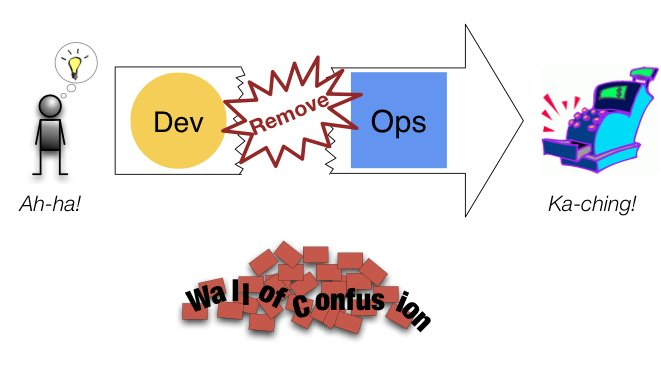
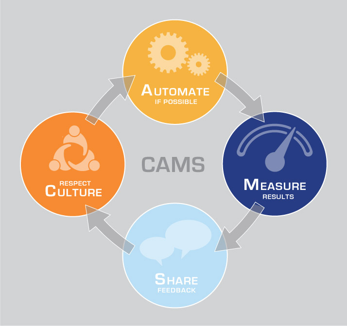
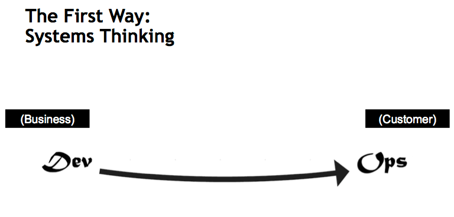
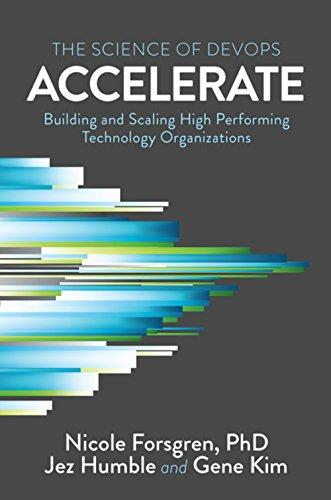

.. -*- mode: rst -*-
.. This document is formatted for rst2s5
.. http://docutils.sourceforge.net/

======================
 DevOps utan floskler
======================

|

|

|

|

|

.. class:: center

      Jonas Linde <jonas.linde@b3.se>

.. raw:: pdf

      PageBreak oneColumn

.. footer::
  jonas.linde@b3.se

.. role:: single
   :class: single

.. role:: grey
   :class: grey

B3 Init AB
==========

* IT-konsulter sedan 1994
* Infrastruktur
* Systemutveckling
* Ledning och Styrning
* DevOps
* Sedan 2017 en del av *B3 Consulting Group*

.. class:: illustration

Jonas Linde
===========

* IT-konsult sedan 1997
* Infrastruktur
* Systemutveckling
* Ledning och Styrning
* DevOps

.. class:: illustration
.. image:: img/mii.png
     :alt: [me]

Agenda
======

* Hur började det?
* Hur har det utvecklats?
* Vad fann vi för utmaningar?
* Har vi gett upp kulturen?
* Vad gäller idag?
* Hur ser framtiden ut?

.. class:: illustration
.. image:: img/dominoes.png
     :alt: [domino]

:single:`Hur började det?`
==========================

Bakgrund

.. class:: illustration
.. image:: img/wallofconfusion.png
     :alt: [Tear down the Wall]

Problemet
=========

.. image:: img/wallofconfusion.png
     :class: fit

Lösningen
=========

C.A.M.S.
========

* Culture

  * empowered teams
  * end-to-end responsibility
  * experimentation platform

* Automation

  * automated builds and testing

* Metrics

  * metrics and monitoring

* Sharing

  * blameless post mortems

.. class:: right

Filosofi
========

.. image:: img/thethreeways-devops.png
     :class: fit

Filosofin - steg 1
==================

Value Stream
============
.. image:: img/Value-Stream.png
     :class: fit

Filosofin - steg 2
==================
.. image:: img/DevOps-SecondWay.png
     :class: fit

Cirkelrörelse
=============
.. image:: img/DevOpsCircle.png
     :class: fit

Filosofin - steg 3
==================
.. image:: img/DevOps-ThirdWay.png
     :class: fit

Inkrementering/Iteration
========================
.. image:: img/badagilemonalisa.png
     :class: fit2

:single:`Hur har det utvecklats?`
=================================

Resultat

.. class:: illustration

Böcker
======
.. image:: img/TPP_3rd_3D_layered_010318.jpg
     :class: sidebyside
.. image:: img/devopshandbook-669x1024.jpg
     :class: sidebyside

Rapporter
=========

Varianter
=========

* DevQAOps
* DevSecOps
* Site Reliability Engineering
* Infrastructure as a Service
* Platform as a Sevice
* Platform Engineering

.. class:: illustration

:single:`Vad fann vi för utmaningar?`
=======================================

Möjligheter

.. class:: illustration

Kultur är svårt
===============

Antipatterns
============

* DevOps-Team
* DevOps-Engineer
* DevOps-Tools

.. class:: right

The DevOps Team
===============

+-------------------------------------------+-------------------------------------------+
|  .. image:: img/devopsteam.png            |  .. image:: img/devopsteam-limited.png    |
|       :height: 250pt                      |       :height: 250pt                      |
+-------------------------------------------+-------------------------------------------+
|  .. image:: img/devopsteam-iaas.png       |  .. image:: img/devopsteam-doaas.png      |
|       :height: 250pt                      |       :height: 250pt                      |
+-------------------------------------------+-------------------------------------------+

.. class:: illustration

DevOps Engineer - en en-persons-silo?
=====================================

|

* Automationstekniker
* Systemadministratör

|

* Site Reliability Engineer
* DevOps Evangelist
* DevOps Coach

.. class:: illustration

DevOps-verktyg
==============

* Atlassian Open DevOps
* Azure DevOps
* DevOps Tooling by AWS
* Gitlab - The Devops Platform
* IBM Cloud DevOps strategy

.. class:: illustration
.. image:: img/azure-devops.jpg
     :alt: [Azure DevOps]

DevQAOps & DevSecOps
====================

DevOps is Dead
==============

:single:`Vad gäller idag?`
==========================

DevOpsDays

.. class:: illustration

DevOpsDays
==========

* 2009 - Ghent
* 2010 - Sydney, Hamburg, Mountain View, São Paulo
* 2013 - 22 platser
* 2017 - 51 platser
* 2019 - 80 platser
* 2020 - 32 platser
* 2023 - 62 platser

.. class:: right

DevOpsDays London 2023
======================

* Platforms are **Something-as-a-Service** - *Abby Bangser*
* **Observability** is Too Damn Expensive! - *Chris Cooney*
* **Systems Thinking** For Dev Organisations - *Lian Li*
* **GreenOps** in the cloud - *Sandro Cirulli*
* **Psychologically Safe** Reliability Management - *Lesley Cordero*
* Have **vendors** destroyed DevOps? - *panel debate*
* How To Train Great **DevOps Engineers**? - *Jack Mead*
* **Inclusion**: a positive experience - *Becky Pauley*
* Navigating **Unconscious Bias** in Open Source Communities - *Aakansha Priya*
* DevOps **over time** - *Kat Samperi*

.. class:: right

State of DevOps 2023
====================

* *Focus on* **users**
* *Technical* **capabilities** *predict performance*
* **Documentation** *is foundational*
* **Reliability** *unlocks performance*
* **Flexible** *infrastructure is key to success*
* *None of this works without investing in* **culture**

.. class:: illustration

SAFe
====

:single:`Hur ser framtiden ut?`
===============================

Mot oändligheten och vidare!

.. class:: illustration

Förutsägelser
=============

* DevOps som kultur är här för att stanna
* Platform Engineering och Something-as-a-Service behöver också DevOps
* DevOps som buzzword kommer att finnas kvar ett tag till
* Psykologisk trygghet är en viktigt del av DevOps-kulturen

.. class:: illustration

Over and out
============

.. image:: img/sleeping_kitteh.jpg
     :alt: [sovande kattunge]
     :class: fit

.. class:: illustration
.. image:: img/dominoes2.jpg
     :alt: [domino]
