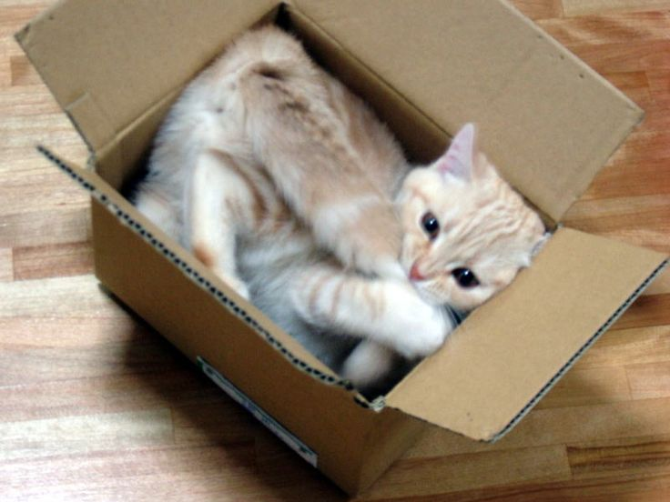

.. -*- mode: rst -*-
.. This document is formatted for rst2s5
.. http://docutils.sourceforge.net/

========================
 DevOpsDays London 2017
========================

|

|

|

|

.. class:: center

      Jonas Linde <jonas@init.se>

.. raw:: pdf

      PageBreak oneColumn

.. footer::
  jonas@init.se

.. role:: single
   :class: single

.. role:: grey
   :class: grey

Historik
========

* 2009 Gent
* 2010 USA, Australien, Tyskland, Brasilien
* 2011 Göteborg + 5 st
* 2013 18 st
* 2016 Stockholm + 41 st
* 2017 51 st

Format
======

* två dagar
* presentationer på förmiddagarna
* open spaces på eftermiddagarna

Presentationer - dag 1
======================

  * Humane Teams

    + colocated vs. dispersed

  * Ops to Dev

    + "not a single piece of code was written with automation in mind"

  * Not Wrong Long

    + testa i prod

  * Metaphors We Compute by

    + metaforer förenklar förståelse

Presentationer - dag 2
======================

  * Healthy Minds

    + 1 of 4 experience mental illness in their lifetime

  * The Oath of Non-Allegiance

    + lista med bra saker
    + Change Management t.ex.

  * ChatOps

    + real-time execution of tooling with simultaneous communiaction

  * Boring is Powerful

    + Hacker news driven development

Ignites
=======

* dag 1

  * How to DevOps on Monolith
  * Continuous Delivery Using Crowdsourced Testing
  * Chaos Theory
  * Monitoring

* dag 2

  * Is Pipeline as Code the next big thing?
  * The Wall of Learning
  * Nudge theory
  * Surviving as a Mum in DevOps

Open Spaces
===========

* dag 1

  * DevOps - Where to start?

    + Silos must go
    + Value Stream Mapping
    + DevOpS

  * Reorganizing teams

    + how to have boundaries without creating new silos

  * Pipeline as code - Jenkins?

    + concourse.ci

* dag 2

  * Signing your commits

    + git duet

  * DevSecOps

    + shift left

  * Retrospective

    + för små gafflar

Hallway track
=============

* RAI
* filefi.sh

One size doesn't fit all
========================

