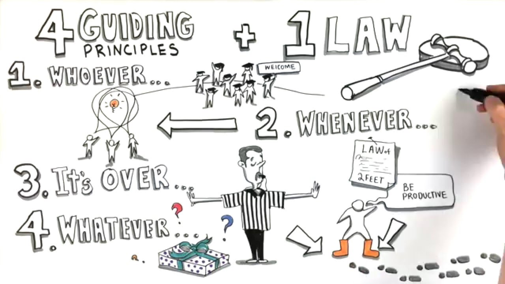

.. -*- mode: rst -*-
.. This document is formatted for rst2s5
.. http://docutils.sourceforge.net/

========================
 DevOpsDays London 2018
========================

|

|

|

.. image:: img/b3it.svg
   :alt: B3IT Init AB
   :target: http://www.b3it.se/

|

.. class:: center

      Jonas Linde <jonas.linde@b3.se>

.. raw:: pdf

      PageBreak oneColumn

.. footer::
  jonas.linde@b3.se

.. role:: single
   :class: single

.. role:: grey
   :class: grey

Struktur
========

* 2 dagar
* 8 föreläsningar
* 9 ignite talks
* 48 open spaces

Open Spaces
===========

* marketplace of ideas
* voting
* distribution
* talking

Open Spaces
===========

How do we talk about culture and DevOps?
========================================

* uppenbarligen svårt
* DevOps är ett luddigt begrepp

Agreeing values rules and what great is
=======================================

* workshop - how - why - what
* Conways lag?

Will serverless change DevOps? / Serverless Use cases and limitations
=====================================================================

* förändra, ja
* ersätta, nej
* få som använder

Managing quality in a CI environment
====================================

* hur hantera olika tester vid automatisering?
* manuella tester
* kapacitetstester
* systemtester

Human benefits of SRE
=====================

* vissa stora företag har SRE-team
* i andra är SRE en roll multifunktionella team
* felbudget

Retro
=====

* väl genomförd retrospektiv
* inga stora anmärkningar
* fortfarande små gafflar

Huvuddrag
=========

* Bygga väl fungerande team

  + empati
  + blameless
  + distans

* Serverless

  + nästa stora grej?

* Inga silos fortfarande viktigt

  + DevOps ursprung

* QA

  + fortfarande en silo?

Over and out
============

.. image:: img/sleeping_kitteh.jpg
     :alt: [sovande kattunge]
     :width: 50%
