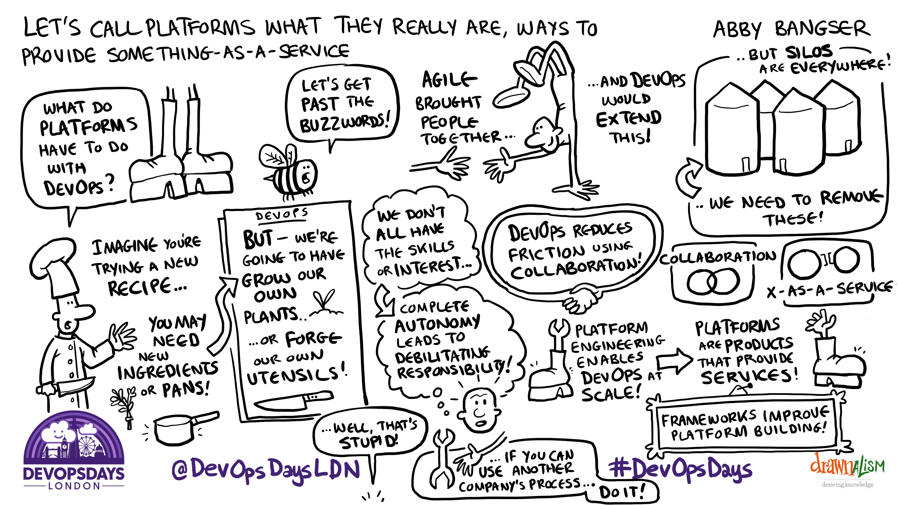

.. -*- mode: rst -*-
.. This document is formatted for rst2s5
.. http://docutils.sourceforge.net/

========================
 DevOpsDays London 2023
========================

|

|

|

|

.. image:: img/b3-tagline.png
   :alt: B3 Init
   :target: http://b3.se/
   :width: 30%

|

.. class:: center

      Jonas Linde <jonas.linde@b3.se>

.. raw:: pdf

      PageBreak oneColumn

.. footer::
  jonas.linde@b3.se

.. role:: single
   :class: single

.. role:: grey
   :class: grey

Struktur
========

* 2 dagar
* 8 föreläsningar
* 9 ignite talks
* 43 open spaces
* 2 paneldebatter

Dag 1
=====

* Föredrag

  * Let's call platforms what they really are, ways to provide something-as-a-Service - *Abby Bangser*
  * Observability is Too Damn Expensive! - *Chris Cooney*
  * Systems Thinking For Dev Organisations - *Lian Li*
  * GreenOps in the cloud - *Sandro Cirulli*

* Ignites

  * Want to build a feedback culture? First focus on observability - *Sorrel Harriet*
  * Quantifying your reliance on Open Source software - *Jamie Tanna*
  * Delivery Metrics: the good, the bad, and the totally ridiculous - *Jennifer Mackown*
  * How To Train Great DevOps Engineers? Apply DevOps Principles! - *Jack Mead*
  * Inclusion: a positive experience - *Becky Pauley*

* Panel

  * Onwards - Evening event - *DOXLON, Adaptavist and GitLab*

Dag 2
=====

* Föredrag

  * Community hacks to enhance your career - *Sam Hepburn*
  * A history of GOV.UK's infrastructure: the long voyage to Kubernetes - *Richard Towers*
  * From Farm to Cloud: Using DevOps to Optimise Agriculture Operations - *Álvaro Santos Andrés*
  * Psychologically Safe Reliability Management - *Lesley Cordero*

* Ignites

  * How winning the AWS GameDay World Championship made us better Devops Engineers - *John Hatton, Rich House*
  * Navigating Unconscious Bias in Open Source Communities - *Aakansha Priya*
  * DevOps over time - *Kat Samperi*

Open Spaces 1:1
===============

* Ideal tech stack forDevOps engineers
* Developer Experience (DevEx)
* Ask us anything: We built the NHS COVID 19 App Backend
* Is DevOps obsolete?
* What should you do when Open Source becomes unethical
* What do developers really want from the platform?
* Secrets management within AWS using GitHub acitons as CI
* DevSecOps: Tools technologies and how to start
* **Ephemeral Dev Environments**

Open Spaces 1:2
===============

* Principals in Centralising vs Ditributing Balance
* How to hire and interview DevOps engineers
* **Platform Engineering**: Best Practices, what worked, what didn't.
* Tech's role in climate action uniting for change
* Let's talk compensation
* What exactly is GitOps and how do I do it
* AI stuffs
* Maintaining and understanding hundreds of repositories
* 10 Years of DevOpsDays London

Open Spaces 2:1
===============

* How to E2E test an app that is made of several microfrontend frameworks right from dev->stage->prod when each component changes at its own pace (yeah that one)
* Diversity & Mental Health in the Workplace
* Team Topologies are you really doing it
* Multi cloud Integration
* K8S bashing the Harry Maguire cruve / What's next for Kubernetes
* I thought Jenkins was Dead? Hudson is that you?
* **Bringing traditional infrastructure people on a DevOps journey**
* Team training when remote
* Developer Portals

Open Spaces 2:2
===============

* DevOps for non-web software
* Deploying + Monitoring Services
* K8 optimisation on "" saving you time & cost
* Contract based testing
* Open Source prioritisation and monetisation
* Preparing for Zero Day CVEs 👻
* **DevOps Back 2 Basics**
* Contibuting back to open source - does your company back you?
* DevOps in regulated environments

Open Spaces 2:3
===============

* Testing CI/CD Pipelines
* Work Life Balance
* OpenTelemetry
* Herd mentality and DevOps
* When is on-call a bandaid for organizational failures
* Platform Communities
* What is the magic potion to get culture change
* Binary provenance/checking nobody has interffered with your deploy artifact
* DevOpsDays London 2023 Retro

:single:`Noteringar`
====================

Something-as-a-Service
======================

Observability
=============

Systems Thinking
================

GreenOps
========

.. class:: speaker

*Sandro Cirulli - The Scale Factory*

* exact numbers of ICT emissions are debatable - scope 1/2/3

  - but significant

* tips

  1. use regions with low emissions (along with latency and cost et al.)
  2. serverless optimizes resource utilization
  3. right-size, maximize utilisation, stop idle
  4. switch to power efficient CPU:s (ARM)
  5. use reserved and spot instances (capacity planning)
  6. store your data efficiently *(cf. Coralogix)*
  7. use CDN
  8. use managed services
  9. well architected review (WAR)
  10. use carbon footprint tools

Onwards evening event
=====================

.. class:: speaker

*DOXLON, Adaptavist and GitLab*

* What has changed?

  - from *Tear-Down-the-Silos* to *Platforms-Engineering*

* Are vendors to blame for the confusion?

  - *Nah, it's in their nature*

Community hacks
===============

A history of GOV.UK
===================

From Farm to Cloud
==================

Psychologically Safe Reliability Management
===========================================

.. class:: speaker

*Lesley Cordero - The New York Times SRE*

* Teams perform better when feeling psychologically safe

  + Trauma-Informed Reliability Managemant

* Chronic problems are the most common threat

  + Remote working is finally accepted
  + Biases are chronic issues

* Intervention

  + Preventative
  + Proactive
  + Reactive

    - blameless post mortems are not applicable for leadership
    - follow up with action - leadership is earned

* With privilege comes responsibility

My Open Spaces
==============

* Ephemeral Dev Environments
* Platform Engineering: Best Practices, what worked, what didn't.
* Bringing traditional infrastructure people on a DevOps journey
* DevOps Back 2 Basics

Over and out
============

.. image:: img/sleeping_kitteh.jpg
     :alt: [sovande kattunge]
     :class: fit
