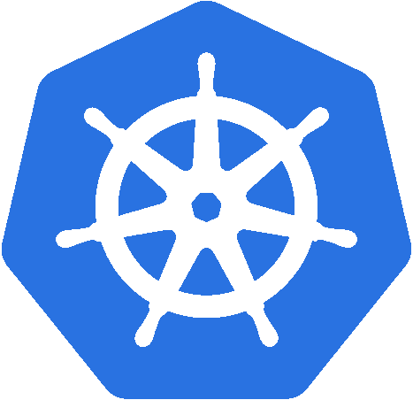
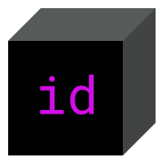

.. -*- mode: rst -*-
.. This document is formatted for rst2s5
.. http://docutils.sourceforge.net/

=============
 FOSDEM 2020
=============

|

|

|

|

.. image:: img/b3-tagline.png
   :alt: B3 Init
   :target: http://b3.se/
   :width: 30%

.. class:: right
.. image:: img/fosdem.png
   :alt: [FOSDEM logo]

|

.. class:: center

    Jonas Linde <jonas.linde@b3.se>

.. raw:: pdf

      PageBreak oneColumn

.. footer::
  jonas.linde@b3.se

.. role:: single
   :class: single

.. role:: grey
   :class: grey

.. default-role:: literal

Day 1
=====

* 2020-02-01

.. class:: illustration
.. image:: img/fosdem.png

How Containers and Kubernetes re-defined GNU/Linux
==================================================

* Cloud computing with vertical lock-in is undermining software freedom
* But Docker and Kubernetes is changing the way we deliver software
* Docker for packaging
* Kubernetes for orchestration
* Kubernetes Operators for full service delivery

.. class:: illustration

Fixing the Kubernetes clusterfuck
=================================

* Falco - Wireshark for kernel packages
* Built on top on IPF
* Can monitor and prevent malicious behaviour
* Demo - privilege escalation in Kubernetes

.. class:: illustration
.. image:: img/falco.png

Google vs Oracle
================

* US Supreme Court case about Java2 SE in Android

* Google took a bunch of declarations

  - there is only one way to do this so copyright can't cover that
  - it's fair use

* Oracle

  - the API is a creative literary work
  - fair use is not allowed to displace market shares

* Google won twice in district court and lost twice in appellate court
* Supreme Court Final decision in June

.. class:: illustration

Day 2
=====

* 2020-02-01

.. class:: illustration
.. image:: img/fosdem.png

Identity box
============

* Public key ≈ identity but not enough
* A decentralized ID resolver must be built on a decentralized network
* A decentralized network need static nodes
* Identity Box is a small device that can be such a node
* It can also handle one or more Self-sovereign ID:s

.. class:: illustration

SCION
=====

* People often try to solve internet on top of internet
* Routing is hard
* SCION has decentralized routing
* The end host defines the path
* It can coexist with IP
* **S**\calability, **C**\ontrol and **I**\solation on next-generati **O**\n **N**\etworks

.. class:: illustration

CfgMgmtCamp
===========

* 2020-02-03 -- 04
* aka Days 5 -- 7
* @HoGent - Hogeschool Gent

.. class:: illustration
.. image:: img/cfgmgmtcamp.png

The Configuration Complexity Clock
==================================

#. Scripts
#.  Config Values
#.  Rules Engine
#.  DSL
#.  GOTO 1

.. class:: right

Pulumi
======

* Orchestrating Cloud infrastructure is complex
* Using YAML doesn't make it less so
* Programming languages are better at handling complexity
* Pulumi is a cross cloud **infrastructure as code** tool
* It supports Node and Python
* and .NET and Go in beta

.. class:: illustration

Nomad
=====

* Container orchestration without the K8s complexity
* Only cluster management and scheduling
* Add other components as needed

  - service discovery
  - monitoring
  - secrets management
  - ...

* By HashiCorp

.. class:: illustration

See you there next time!
========================

* FOSDEM: 2021-01-30 -- 31
* CfgMgmtCamp: 2020-02-01 -- 03

.. class:: right
.. image:: img/206.jpg
   :alt: [206 Partial Content]
