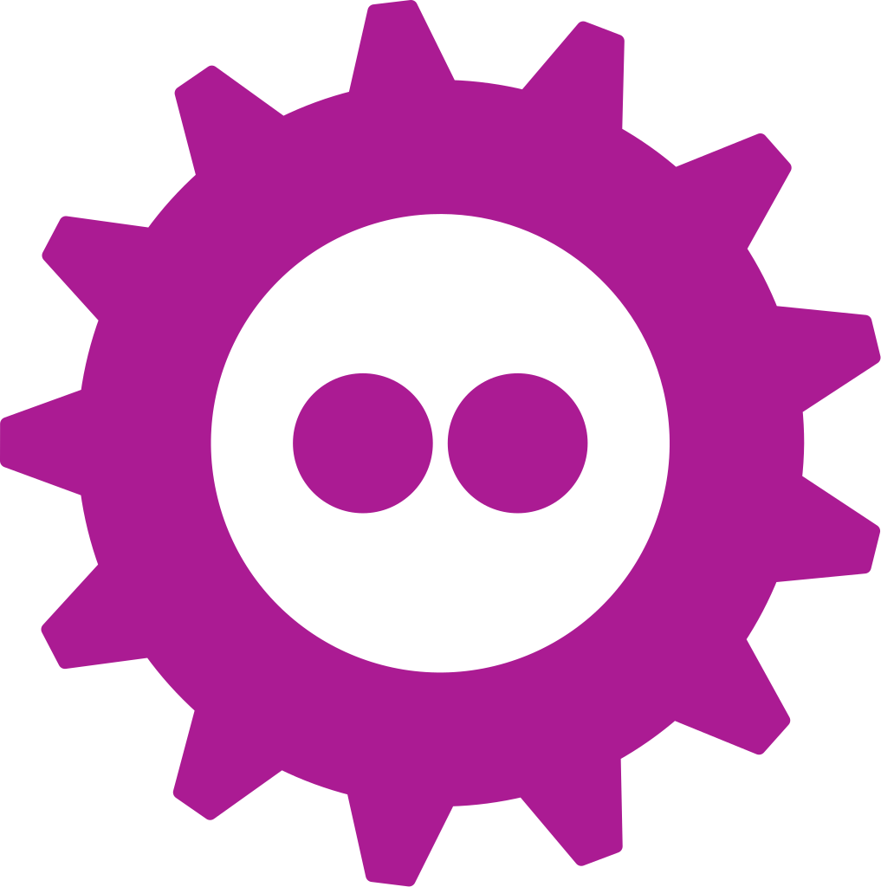
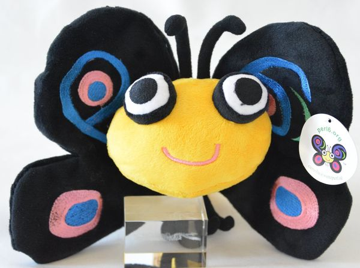

.. -*- mode: rst -*-
.. This document is formatted for rst2s5
.. http://docutils.sourceforge.net/

=============
 FOSDEM 2023
=============

|

|

|

|

.. image:: img/b3-tagline.png
   :alt: B3 Init
   :target: http://b3.se/
   :width: 30%

.. class:: right

|

.. class:: center

    Jonas Linde <jonas.linde@b3.se>

.. raw:: pdf

      PageBreak oneColumn

.. footer::
  jonas.linde@b3.se

.. role:: single
   :class: single

.. role:: grey
   :class: grey

.. default-role:: literal

The Perl and Raku Foundation
============================

* *Yet Another Society* :sup:`®`

  + aka. *The Perl Foundation*
  + aka. *The Perl and Raku Foundation*

* inget Perl dev-room 2023

  + men en "booth"
  + och stipendium till talare

* Community dinner

  + och en organizers dinner

    + en svensk, en holländare, en amerikan och en ukrainare
    + norrmannen och engelsmannen dök aldrig upp
    + den italienska kyparen kan eventuellt ha hetat Bellman

.. class:: illustration

Samtal
======

* "Perl is a write-only language, right?"
* "What's the primary use case for Perl/Raku?"
* "What's the difference between Perl and Raku?"
* "What's the difference between Perl 6 and Raku?"
* "Which Raku book is best for beginners/intermediates?"
* "What's a Tuit?"
* "How much for the butterfly plushy?"

.. class:: illustration

