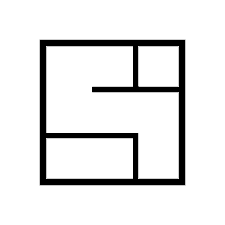
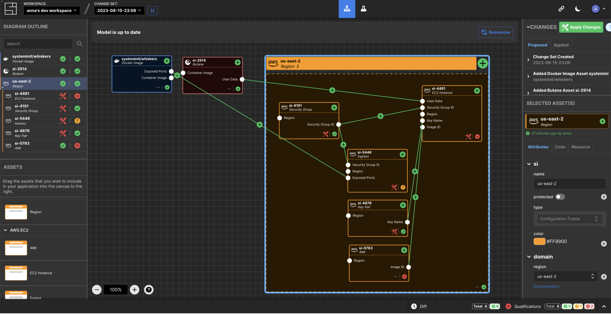

.. -*- mode: rst -*-
.. This document is formatted for rst2s5
.. http://docutils.sourceforge.net/

===========================
 FOSDEM & CfgMgmtCamp 2025
===========================

|

|

|

|

.. image:: img/cfgmgmtcamp.png
   :alt: CfgMgmtCamp
   :target: http://b3.se/
   :width: 30%

.. class:: right
.. image:: img/fosdem.png
   :alt: [FOSDEM logo]

|

.. class:: center

    Jonas Linde <jonas.linde@b3.se>

.. raw:: pdf

      PageBreak oneColumn

.. footer::
  jonas.linde@b3.se

.. role:: single
   :class: single

.. role:: grey
   :class: grey

.. default-role:: literal

The future is a hypergraph - *Adam Jacob*
=========================================

* System Inititiative
* Configuration as a Model
* Open Source

  + Apache license
  + github.com/systeminit/si
  + systeminit.com

.. class:: illustration

SI
======

.. class:: full

Breaking Barriers - *Joseph Katsioloudes*
=========================================

* *The Art of (Free) Gamified Security Training*
* Problem:

    Security Training is Boring

    Security Team doesn't scale

* Solution:

    Make developers enjoy security training

.. class:: illustration

Demo - Live Coding
==================

* https://gh.io/secure-code-game

.. class:: right

