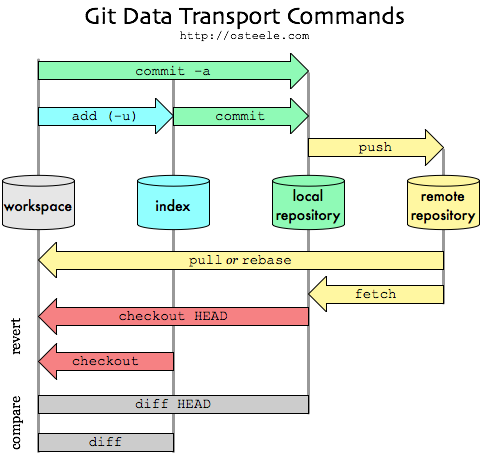

.. -*- mode: rst -*-
.. This document is formatted for rst2s5
.. http://docutils.sourceforge.net/

=====
 GIT
=====
|

|

|

.. image:: img/init180x170.gif
   :alt: Init AB
   :target: http://www.init.se/

|

.. class:: center

    Jonas Linde <jonas@init.se>

.. raw:: pdf

      PageBreak oneColumn

.. footer::
  jonas@init.se

.. role:: single
   :class: single

.. role:: grey
   :class: grey

Background
==========

* for the Linux kernel
* speed
* distributed
* cheap merges
* BitKeeper is doing it right
* CVS anv Subversion is doing it wrong

Objects
=======

* files (blob)
* directories (tree)
* commits
* tags

Data flow
=========

.. class:: right

* working directory = HEAD + uncommited changes
* index = staged files

Remotes
=======

* clone
* remote add
* fetch
* pull
* push

Work flow
=========

* pull

 + fetch + merge
 + fast-forward

* change files
* add/rm/mv/stage
* commit
  
 +  rebase
 +  reset (https://xkcd.com/1597/)

* push

Branches
========

.. class:: right
.. image:: img/branches.svg
     :alt: [Branches]
     :width: 30%

* branch
* tag
* checkout

Conflicts
=========

* merge
* fix
* add
* commit
