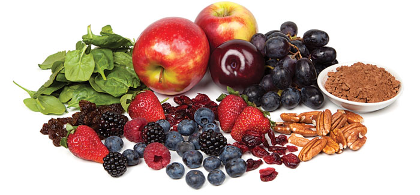
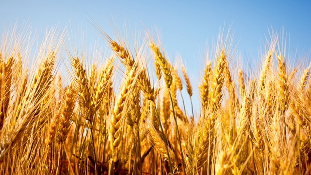
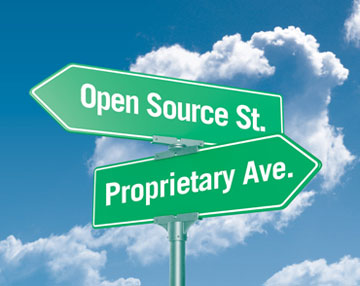

.. -*- mode: rst -*-
.. This document is formatted for rst2s5
.. http://docutils.sourceforge.net/

===========================
 IoT - Öppet eller stängt?
===========================

|

|

|

.. image:: img/init180x170.gif
   :alt: Init AB
   :target: http://www.init.se/

|

.. class:: center

    Jonas Linde <jonas@init.se>

.. raw:: pdf

      PageBreak oneColumn

.. footer::
  jonas.linde@init.se

.. role:: single
   :class: single

.. role:: grey
   :class: grey

Internet of Things
==================

* 10 miljarder enheter 2010
* Gartner: 25 miljarder enheter 2020
* Cisco: 50 miljarder enheter 2020
* IBM: 1 biljon enheter 2015 !!!!!

.. class:: illustration
.. image:: img/dominoes.png
     :alt: [dominoes]

Regleringar
===========

* Både EU och USA håller på att ta fram regleringar
* I USA har det förkommit rättsfall med uppgörelser på stora belopp
* EU-kommissionen satsar på en gemensam marknad för IoT
* … under tiden tar industrin fram egna standard\ **er** …

.. class:: illustration

Utmaningar
==========

* Datainsamling
* Datasäkerhet
* Fysisk säkerhet
* Privatliv
* Bandbredd
* Kompatibilitet

.. class:: illustration

Datasäkerhet
============

* Data ägs inte nödvändigtvis av den som äger enheten
* Anonymisering funkar …
* … men det gör re-identifiering också
* Företag kommer sannolikt att hållas ansvariga

.. class:: illustration

*Internet of things research study*, HP 2015
============================================

* 90% samlar in minst en personuppgift
* 70% data utan krypering

.. class:: illustration

Policy
======

* Företag försöker minimera sina risker

.. class:: illustration

Kompatibilitet
==============

* En stor mängd standarder är under framtagning
* En större mängd enheter är under framtagning
* Lönsamheten i instängt data är stor
* När mängden data växer, ökar potentialen för delat data
* En modell är att data köps och säljs

.. class:: illustration
.. image:: img/lingon.png
     :alt: [lingon]

Self-sovereign Identity
=======================

* En annan modell är att enskilda tar kontrollen över "sitt" data
* Kanske med hjälp av *block chains*

.. class:: illustration

Kan vi lita på IoT?
===================

* Jämför med jordbruksrevolutionen
* ett stort kliv för mänskligheten
* men för individen?

|

Öppet eller stängt
==================

* Icke-öppna standarder hämmar utvecklingen!
* Proprietärt data är värdefullt!
* Människor är lata …

.. class:: illustration

:single:`Tack för ordet!`
=========================

.. class:: illustration
.. image:: img/dominoes2.jpg
     :alt: [more dominoes]
