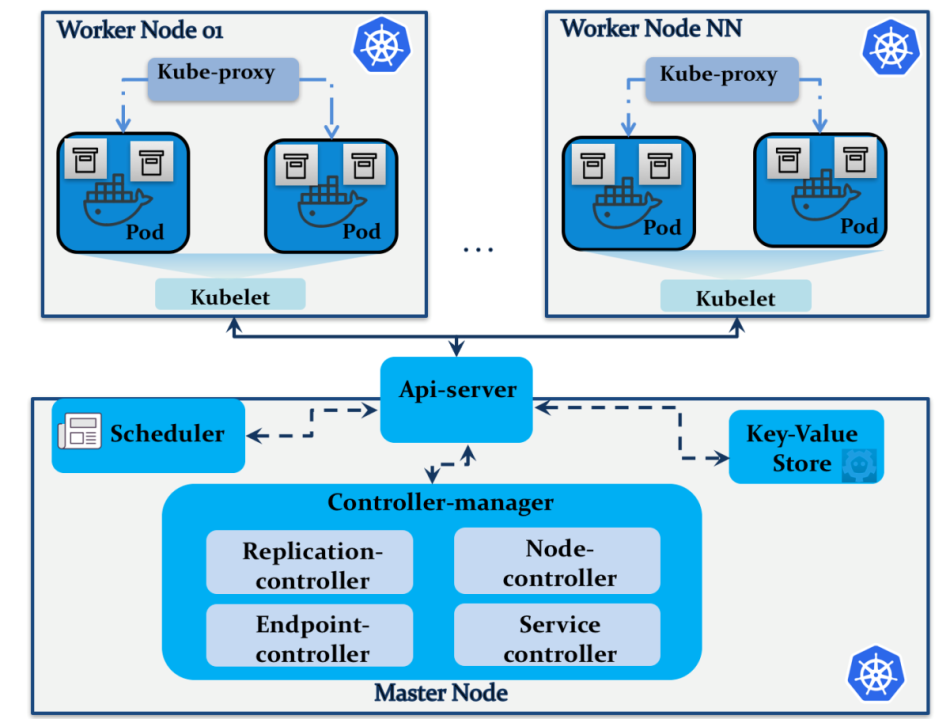

.. -*- mode: rst -*-
.. This document is formatted for rst2s5
.. http://docutils.sourceforge.net/

============
 Kubernetes
============

|

|

|

|

.. image:: img/b3-tagline.png
   :alt: B3 Init
   :target: http://b3.se/
   :width: 30%

.. class:: right
.. image:: img/kubernetes.png
   :alt: [Kubernetes wheel]

|

.. class:: center

    Jonas Linde <jonas.linde@b3.se>

.. raw:: pdf

      PageBreak oneColumn

.. footer::
  jonas.linde@b3.se

.. role:: single
   :class: single

.. role:: grey
   :class: grey

.. default-role:: literal

Jonas Linde
===========

* IT-konsult sedan 1997
* Infrastruktur
* Systemutveckling
* DevOps

.. class:: illustration
.. image:: img/mii.png
     :alt: [me]

Agenda
======

* Översikt
* Detaljer
* Verktyg
* Demo
* O.s.v.

.. class:: illustration
.. image:: img/lingon.png
     :alt: [lingon]

:single:`Översikt`
==================

.. class:: right
.. image:: img/steeringwheel.jpeg
     :alt: [master and worker nodes]
     :width: 50%

Arkitektur
==========

* "Kubernetes (k8s) is an open-source system for automating
  deployment, scaling, and management of containerized applications."

.. class:: right

Varför?
=======

* "Kubernetes takes the kernel constructs that are containers and lets
  you make highly available applications that do all sorts of fun
  things." - Jamie Duncan, Sr. Cloud Something at RedHat

   https://opensource.com/life/16/2/lightning-talk-kubernetes-intro

Resurser
========

* Node
* Deployment DaemonSet ReplicaSet StatefulSet
* Pod Job CronJob
* Service Ingress
* StorageClass PersistentVolume PersistentVolumeClaim
* Configmap Secret

Metadata
=========

* Annotations
* Labels
* NodeSelector
* Taints
* Tolerations
* Affinity

:single:`Detaljer`
==================

.. class:: right

Nodes
=====

* en eller flera VM:ar
* kör containrar

  * har container-loggarna

* hanterar nätverket

Enheter
=======

* Deployment

  * deklaration av Pods och ReplicaSets

* StatefulSet

  * som Deployment men med state

* DaemonSet

  * Pods som ska köras på *alla* noder

Containrar
==========

* Pod

  * innehåller en eller flera containrar
  * startas om om den avslutas

* Job

  * startas bara en gång

* CronJob

  * startas periodiskt

.. class:: illustration
.. image:: img/docker-whale-home-logo.png
     :alt: [containers]

Åtkomst
=======

* Service

  * Pods är tillfälliga; de kan krascha eller flyttas
  * en Service är en stabil endpoint

* Ingress

  * en Ingress exponerar Services
  * en Ingress Controller utför själva nätverkskopplingen

Lagring
=======

* StorageClass

  * type av lagring för automatisk skapning

* PersistentVolume

  * k8s-enhet som representerar en lagringsenhet

* PersistentVolumeClaim

  * kopplar en volym till en Pod

Konfiguration
=============

* ConfigMap

  * en bunt nyckel-värde-par

* Secret

  * en bunt "hemliga" nyckel-värde-par
  * base64-kodade (sic!)

Metadata
=========

* Labels

  * nyckel-värde-par
  * kan användas för att peka ut objekt eller grupper av objekt

* Annotations

  * kan innehålla strukturerat metadata
  * valfri användning

* metadata kan knytas till olika typer av resurser

Metadata för att välja Node
===========================

* NodeSelector

  * låter en Pod välja Node via en Label

* Taints

  * spärrar användning av en Node

* Tolerations

  * tolererar Taints

* Affinity

  * ett nytt kraftfullare sätt att välja Node

Nätverk
=======

* via klusternätet kan en Pod kommunicera med alla andra Pods
* routing sker via iptables-regler

  * t.ex. 172.1.0.3

* Nodes har vanliga IP-adresser

  * t.ex. 10.1.2.3

* en Ingress Controller kopplar externa adresser till Services

* det finns massor av lösningar för s.k. overlay networks

:single:`Verktyg`
=================

.. class:: right
.. image:: img/tools.jpg
     :alt: [tools]
     :width: 40%

Kubectl
=======

* det huvudsakliga verktyget för att hantera ett k8s-kluster

  https://kubernetes.io/docs/tasks/tools/install-kubectl/

  https://opensource.com/article/18/12/kubectl-definitive-pronunciation-guide

Minikube
========

* ett en-nods-kluster på localhost

  https://kubernetes.io/docs/tasks/tools/install-minikube/

Helm
====

* "The k8s package manager"

  https://helm.sh/

Kubespray
=========

* "an incubated Kubernetes community project for deploying K8s clusters"
* i praktiken en bunt Ansible playbooks

Publika moln
============

* GCE
* EKS
* AKS
* m.fl.

.. class:: right

:single:`Demo`
==============

.. class:: right

Demo
====

* https://kubernetes.io/docs/tutorials/hello-minikube/

  .. code::

     minikube start
     kubectl create deployment hello-node \
        --image=gcr.io/hello-minikube-zero-install/hello-node
     kubectl get all
     kubectl get events
     kubectl describe pod
     kubectl expose deployment hello-node --type=LoadBalancer --port=8080
     kubectl get all
     kubectl config view
     server=$(kubectl config view -o json |
              jq -r .clusters[].cluster.server | cut -d: -f2)
     port=$(kubectl get services -o json hello-node | jq .spec.ports[].nodePort)
     curl -i http:$server:$port/; echo

:single:`O.s.v.`
================

.. class:: right

Ytterligare komponenter
=======================

* ClusteAutoscaler

  * ResourceRequest
  * ResourceLimit

* DnsController
* mätvärden
* monitorering
* m.m.

:single:`Tack för ordet!`
=========================

.. class:: illustration
.. image:: img/dominoes2.jpg
     :alt: [more dominoes]

.. class:: right
.. image:: http://http.cat/206
     :alt: [more dominoes]
     :width: 25%
