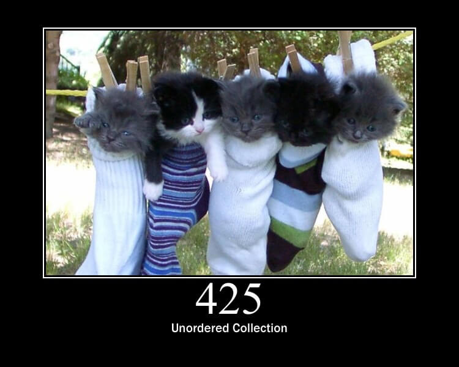

.. -*- mode: rst -*-
.. This document is formatted for rst2s5
.. http://docutils.sourceforge.net/

===========
 Micronomy
===========

|

|

.. image:: img/b3-tagline-grey.png
   :alt: B3 Init
   :target: http://b3.se/
   :width: 50%

|

.. class:: center

    Jonas Linde <jonas.linde@b3.se>

.. raw:: pdf

      PageBreak oneColumn

.. footer::
  jonas.linde@b3.se

.. role:: single
   :class: single

.. default-role:: literal

Vad?
====

* Micronomy är en webapp som pratar med Maconomys backend
* med andra ord en alternativ frontend till Maconomy

.. class:: illustration
.. image:: img/question.png

Varför?
=======

* GUI:t i Maconomy är irriterande
* Därför!

.. class:: illustration
.. image:: img/deltek-touch.jpg

API?
====

* Maconomy RESTful Web Services - Programmer's Guide 2018
* Maconomy RESTful Web Services - Programmer's Guide 2021
* Firefox Web Developer tools

.. class:: illustration
.. image:: img/firebug.png

Registrera timmar
=================

 .. code::

  curl -H "Authorization: X-Reconnect $token"
       -H "Maconomy-Concurrency-Control: $concurrency" \
       -H "Content-Type: application/json" \
       -d '{"data": {"numberday5": 3}}' \
       "$url/data;any/table/$rownum?card.datevar=2019-12-06"

* där

  * `$concurrency` kommer från `.panes.table.records[$rownum].meta.concurrencyControl`
  * `$rownum` pekar på vilket projekt datat gäller
  * veckodag anges med siffran i `numberday5`
  * vecka anges med `card.datevar`

.. class:: illustration
.. image:: img/clock.jpg

Data
====

 .. code::

  {
    "meta": {},
    "links": {},
    "panes": {
      "card": {},
      "table": {
        "meta": {},
        "links": {},
        "records": [
          {
            "meta": {},
            "links": {},
            "data": {}
          },
        ],
        ...
      }
    }
  }

.. class:: right

Språk?
======

* Javascript

  * fördel: ingen extra server
  * nackdel: riskerar att bli långsamt

* bash, curl & jq

  * fördel: enkelt
  * nackdel: svårt

* Raku

  * fördel: ett riktigt språk
  * nackdel: extra server

.. class:: illustration
.. image:: img/curl.jpg

Cro
===

* en bunt Raku-moduler för att bygga reaktiva distribuerade system
* inbyggd HTTP-server
* inbyggd HTTP-klient
* flexibel request router
* utbyggbar content decoder

.. class:: illustration
.. image:: img/cro.png

Cro::WebApp
===========
  .. code::

   ├ ./ - 5 filer
   ├ cli/ - 3 filer
   ├ lib/ - 2 filer
   │ ├ Micronomy/ - 3 filer
   └ resources/ - 9 filer
     ├ fake-tls/ - 2 filer
     ├ script/ - 2 filer
     ├ styles/ - 4 filer
     └ templates/ - 4 filer

.. class:: right
.. image:: img/206.jpg

Demo
====

https://micronomy.init.se

:single:`Tack för ordet!`
=========================

.. class:: illustration
.. image:: img/dominoes2.jpg

.. class:: right

