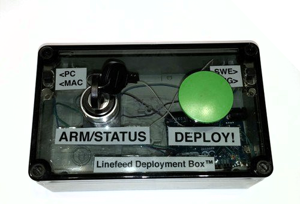

.. -*- mode: rst -*-
.. This document is formatted for rst2s5
.. http://docutils.sourceforge.net/

==================
Delivery Pipelines
==================

|

|

|

.. image:: img/init180x170.gif
   :alt: Init AB
   :target: http://www.init.se/

|

.. class:: center

      Jim Svensson <jimpa@init.se> & Jonas Linde <jonas@init.se>

.. raw:: pdf

      PageBreak oneColumn

.. footer::
  jonas@init.se & jimpa@init.se

.. role:: single
   :class: single

.. role:: grey
   :class: grey

Frågeställningar
================

* Vad är/ingår en/i delivery pipeline?
* Best practice? Verktyg?
* Huvudsakliga problem som måste adresseras?
* Automatiska & manuella flöden?

.. class:: illustration

Vad ingår i en delivery pipeline?
=================================

* Källkodsrepository
* Bygga
* Enhetstesta
* Paketera
* Kolla kodkvalitet
* Mockade integrationstester
* Skapa testmiljö
* Leverera
* Testa

.. class:: illustration
.. image:: img/checkbox.gif
     :alt: [check]

Best practice?
==============

#. Checka in till en branch
#. Enhetstesta
#. Merga till master
#. Leverera till testmiljöer

* Avbryt vid fel!
* Automatisk rollback?

.. class:: illustration
.. image:: img/testbot.jpeg
     :alt: [testbot]

Verktyg?
========

* Jenkins
* Travis CI
* Go CD
* Sonar kodanalys
* ...

.. class:: illustration
.. image:: img/jenkins.png
     :alt: [Jenkins]

Best practice för verktyg?
==========================

* Även pipeline-definitionen är kod!
* Visualisering är viktigt!

.. class:: illustration
.. image:: img/dominoes.png
     :alt: [dominoes]

Huvudsakliga problem som måste adresseras?
==========================================

* Repeterbarhet
* Hastighet
* Testtäckning
* Produktionslikhet
* Hemligheter

.. class:: illustration
.. image:: img/lingon.png
     :alt: [lingon]

Automatiska & manuella flöden?
==============================

* Så mycket som möjligt ska ske automatiskt
* Långsamma tester kan läggas utanför pipelinen

  * ex.v. prestandatester

* Tunga tester kan även delas upp och köras parallellt
* Produktionssättning kan vara automatisk

  * om man litar på testerna  

.. class:: illustration

:single:`Frågor?`
=================

.. class:: illustration
.. image:: img/question.png
     :alt: [question mark]

:single:`Tack för ordet!`
=========================

.. class:: illustration
.. image:: img/dominoes2.jpg
     :alt: [more dominoes]
