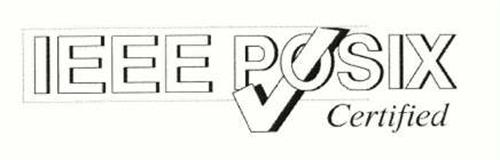
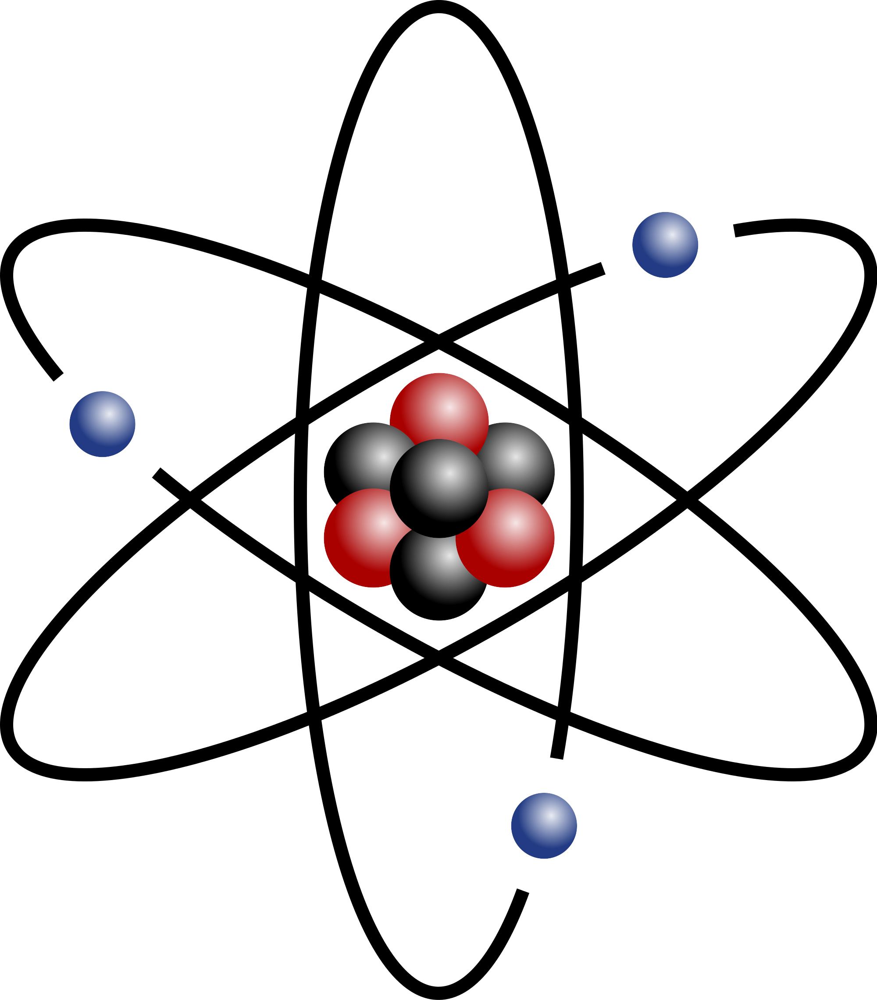
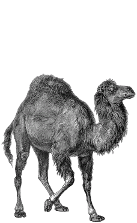
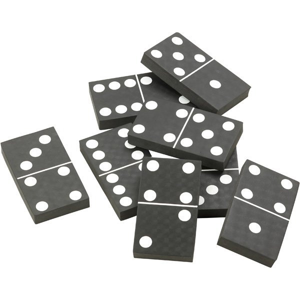

.. -*- mode: rst -*-
.. This document is formatted for rst2s5
.. http://docutils.sourceforge.net/

===================
 Reguljära Uttryck
===================

|

|

|

|

.. class:: center

      Jonas Linde <jonas@init.se>

.. raw:: pdf

      PageBreak oneColumn

.. footer::
  jonas@init.se

.. role:: single
   :class: single

.. role:: grey
   :class: grey

Historik
========

* Stephen Cole Kleene (matematiker), 1956, *regular language*
* etymologi: "reglerade uttryck"
* började användas på allvar i Unix på 70-talet
* reguljära uttryck är "enkla" för en dator att tolka
* utökade för att bli praktiskt användbara
* standardiserade i POSIX.2 1992

Varianter
=========

* POSIX basic RE (aka. obsolete RE)
* POSIX extended RE (aka. modern RE)
* GNU-tillägg
* Perl compatible RE (pcre)
* andra programmeringsspråk

.. class:: illustration

Verktyg
=======

* grep, egrep
* vi, emacs
* ed, sed, awk, tcl
* ansible, chef, puppet
* perl, python, bash

.. class:: illustration
.. image:: img/emacs-vim.png
     :alt: [editor war]

Uppbyggnad
==========

* deluttryck
* metatecken
* man 7 regex

Uppbyggnad
==========

* RE = grenar separerade av "``|``"
* gren = delar
* del = atom med ev. antal
* antal = "``*``", "``?``", "``+``", ``{i}``, ``{i,}`` eller ``{i,j}``
* atomer - t.ex. bokstäver - se nedan

Matchning
=========

* ett RE *matchar* omm **någon** av grenarna matchar
* en gren matchar omm **alla** delar matchar (i rätt ordning)

  Exempel: uttrycket "``abc``" består av en gren som består av delarna
  "``a``", "``b``" och "``c``" och matchar alla strängar som
  innehåller ett "``a``" omedelbart följt av ett "``b``" omedelbart
  följt av ett "``c``".

Backtracking
============

* algoritmen för att matcha ett RE bygger på trial-and-error

  Exempel::

    echo '{"key": "value"}' | grep -o '".*":'

* ``"`` matchar första tecknet; ``.*`` matchar **resten** av raden; ``"`` misslyckas
* algoritmen låter ``*`` backa ett steg; då matchar sista ``"`` också
* men inte ``:``; algoritmen backar tills alla fyra delarna matchar

Atom
====

* enstaka tecken utom *metatecken*

  ``^ $ . [ * \ | ( ) ? + {``

* en "``.``"
* en "``\``" följt av valfritt tecken
* en *mängd* inom ``[]``
* ett specialuttryck inom ``[]``
* en *referens* - d.v.s. en "``\``" följt av en *siffra*
* ett **RE** inom ``()``

.. class:: right

Metatecken i BRE & ERE
======================

      ====== ======================================
      ``^``  början av rad eller sträng
      ``$``  slut av rad eller sträng
      ``.``  godtyckligt tecken
      ``[]`` mängder och specialuttryck - se nedan
      ``*``  noll eller fler av föregående atom
      ``\``  *metaomvandlare*?
      ====== ======================================

Metatecken endast i ERE
=======================

      ========= ===============================================
      ``|``     grenavgränsare                                
      ``()``    gruppering                                    
      ``?``     noll eller en av föregående atom              
      ``+``     en eller fler av föregående atom              
      ``{i}``   exakt *i* st. av föregående atom              
      ``{i,}``  minst *i* st. av föregående atom              
      ``{i,j}`` minst *i* men högst *j* st. av föregående atom  
      ========= ===============================================

Skillnader i BRE
================

* ``| + ? ( ) { }`` är vanliga tecken
* antal skrivs med "``\{``" och "``\}``"
* grupperingar skrivs med "``\(``" och "``\)``"

.. class:: illustration

Tillägg i GNU
=============

      ================ ==================================================
      ``\n,\t,\r,``    newline, tab, carriage-return etc.
      ``{,j}``         högst *j* st. av föregående atom
      ``\< \>``        början resp. slut av ord
      ``\b \B``        tom sträng vid *ordgräns* resp. inuti ett ord
      ``\w \W``        samma som ``[_0-9a-zA-Z]`` resp. ``[^_0-9a-zA-Z]``
      ``\? \+ \|``     istället för ``? + |`` i BRE
      ================ ==================================================

.. class:: illustration

Mängder
=======

* står inom hakparenteser - ``[]``
* uppräkning av tecken - t.ex. ``[acdef]``
* interval: två tecken med "``-``" emellan - t.ex. ``[ac-f]``
* negation: första tecknet är ``^`` - t.ex. ``[^b]``
* "``]``" som första tecken (eller andra om första är "``^``")
* "``-``" som första eller sista tecken
* metatecken: "``^``", "``-``" och vissa kombinationer med "``[``"

Referenser
==========

* refererar tidigare angivna parenteser ``()``
* numreras via vänsterparentesen ``(``
* två användningsområden

 + bakåtreferens

   ``a([bc])\1d`` (matchar "``abbd``" och "``accd``" men inte "``abcd``")

 + ersättning

   ``s/a([bc])d/A\1D/`` (ersätter "``abd``" med "``AbD``" och "``acd``" med "``AcD``")
   
Specialuttryck
==============

* teckenklass ``[[: :]]`` ::

   alnum   digit   punct   alpha   graph   space
   blank   lower   upper   cntrl   print   xdigit

* ekvivalensklass ``[[= =]]`` ::

   echo Citroner á 2:- | LC_COLLATE=en_US.UTF-8 grep "[ [=a=] ]"
   echo Citroner á 2:- | grep [^[=c=]]

* kollationeringselement ``[[. .]]`` ::

   echo Ålborg | LC_COLLATE=da_DK.UTF-8 egrep '[Ä-[.Aa.]]'

Perl compatible RE
==================

* non-greedy matches: ``".*?"``
* non-backtracking: ``".*+"``
* non-capturing: ``(?:...)``
* named captures: ``(?<name>...)``
* extended escape sequences
* etc. ::

    man perlre

.. class:: right

Perl6
=====

* Nästan helt annorlunda uttryck!
* Men ``perl6-debug`` kan användas för att debugga vanliga RE

* https://perl6advent.wordpress.com/2012/12/05/a-perl-6-debugger/

.. class:: illustration
.. image:: img/camelia-logo.png
     :alt: [Camelia]

Övningar
========

* https://regexone.com/
* https://regexone.com/lesson/end
* https://alf.nu/RegexGolf
* https://regexcrossword.com/

.. class:: illustration

Katter
======

