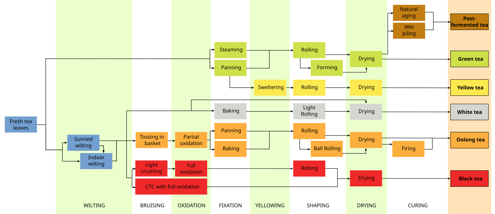

.. -*- mode: rst -*-
.. This document is formatted for rst2s5
.. http://docutils.sourceforge.net/

=======
 Om Te
=======

|

|

|

|

.. class:: right
.. image:: img/418.jpg
   :alt: I'm a teapot
   :target: https://http.cat/418
   :width: 50%

|

.. class:: center

    Jonas Linde <jonas.linde@b3.se>

.. raw:: pdf

      PageBreak oneColumn

.. footer::
  jonas.linde@b3.se

.. role:: single
   :class: single

.. role:: grey
   :class: grey

.. default-role:: literal

Vad är te?
==========

|

* Camelia Sinensis
* Infusion / Brygd
* Varmt vatten med något i

.. class:: right
.. image:: img/Camelia-Sinensis.jpg
   :alt: Shrubbery

.. class:: illustration

Var kommer te ifrån?
====================

|

+--------------------+----------------+--------------------+-------------------------+
|                    | Kina           |                    | Kina                    |
+--------------------+----------------+--------------------+-------------------------+
|                    | Indien         |                    | Kenya                   |
+--------------------+----------------+--------------------+-------------------------+
|                    | Kenya          |                    | Sri Lanka               |
+--------------------+----------------+--------------------+-------------------------+
|                    | Sri Lanka      |                    | Indien                  |
+--------------------+----------------+--------------------+-------------------------+
|                    | Turkiet        |                    | Polen                   |
+--------------------+----------------+--------------------+-------------------------+
|                    | Indonesia      |                    | Tyskland                |
+--------------------+----------------+--------------------+-------------------------+
|                    | Vietnam        |                    | Japan                   |
+--------------------+----------------+--------------------+-------------------------+
|                    | Japan          |                    | United Arab Emirates    |
+--------------------+----------------+--------------------+-------------------------+
|                    | Iran           |                    | United Kingdom          |
+--------------------+----------------+--------------------+-------------------------+
|                    | Argentina      |                    | Vietnam                 |
+--------------------+----------------+--------------------+-------------------------+

.. class:: illustration

Hur produceras te??
===================

|

* Plockning
* Torkning
* Rullning
* Oxidering
* Fixering

.. class:: right

Hur produceras te??
===================

.. class:: full

Hur tillreds te?
================

|

* Värm vatten till 60-100°C
* Häll vattnet på bladen
* Vänta i 15-600 sekunder
* Häll upp

|

* eller besök `Yocha Studio`_

.. _Yocha Studio: https://www.yochastudio.com/menu

.. class:: right

Tein
====

|

* Samma som koffein
* Ungefär lika mycket i te som i kaffe
* Ungefär lika mycket i grönt te som i svart te
* Motverkas i te av l-teanin

.. class:: right

.. class:: illustration
.. image:: img/l-theanine.png
   :alt: L-theanine

Provsmakning
============

.. class:: right

